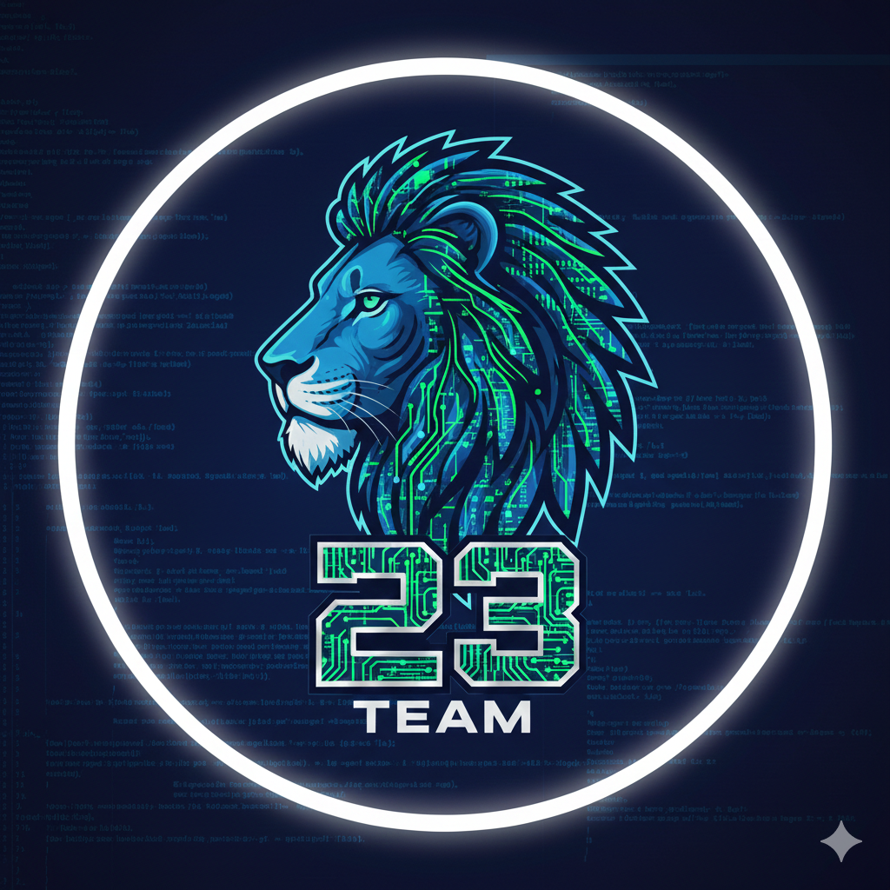

# Team Information

## Team Name
**Team 23** <i>- to be determined</i>

## Team 23


## Team Members

| Name                   | GitHub Username                                      | Role                         |
| ---------------------- | ---------------------------------------------------- | ---------------------------- |
| Ingvar-Vilmar Leerimaa | [@IngvarLeerimaa](https://github.com/IngvarLeerimaa) | Contributor/Repository Owner |
| Andrii Lytvyn          | [@andrewlytvyn](https://github.com/andrewlytvyn)     | Contributor                  |
| Bohdan Podziubanchuk   | [@Danbog32](https://github.com/Danbog32)             | Contributor                  |
| Olga Tenison           | [@olgatenison](https://github.com/olgatenison)       | Contributor                  |
| Mahdiyeh Sepehrar      | [@sepehrar](https://github.com/sepehrar)             | Contributor                  |

**Team Lead / Integrator:** [Ingvar-V. Leerimaa](https://github.com/IngvarLeerimaa)

**Mentor:** Bahdan Yanovich

## Team Workflow

### Branch Naming Convention

We follow a prefix-based branch naming convention for clarity.<br>
Reference: [Git Branch Naming Conventions 2025](https://medium.com/@jaychu259/git-branch-naming-conventions-2025-the-ultimate-guide-for-developers-5f8e0b3bb9f7)

| Prefix      | Usage                                | Example                           |
| ----------- | ------------------------------------ | --------------------------------- |
| `feature/`  | New functionality                    | `feature/dark-mode-toggle`        |
| `fix/`      | Bug fixes                            | `fix/login-button-error`          |
| `hotfix/`   | Critical production fixes            | `hotfix/payment-processing-issue` |
| `refactor/` | Code restructuring (no new features) | `refactor/auth-module`            |
| `docs/`     | Documentation updates                | `docs/api-v2-update`              |
| `test/`     | Test-related changes                 | `test/unit-coverage-improvement`  |
| `chore/`    | Maintenance tasks                    | `chore/update-deps-2025`          |

### Development Process

1. **Pick a task** - Select an issue from GitHub Issues or coordinate with the team
2. **Create a branch** - Branch off from `develop` using the naming convention above
3. **Develop** - Make multiple meaningful commits with clear messages
4. **Push regularly** - Push your branch to GitHub frequently
5. **Open a Pull Request** - Create a PR into `develop` with a clear description:
   - **Why:** Link to issue or explain the motivation for the change
   - **What:** Summarize what was changed
   - **How to test:** Steps to verify the change works (if applicable)
   - **Evidence:** Screenshots for UI changes, or test results if applicable
6. **Code Review** - At least one team member must review and approve
7. **Merge** - Use the appropriate merge strategy (see below)
8. **Cleanup** - Merged branches are automatically deleted

### Commit Message Guidelines

- Use clear, descriptive commit messages
- Start with a verb in imperative mood (Add, Fix, Update, Refactor, etc.)
- Reference issue numbers when applicable: `Fix login error (#12)`

### Branch Structure

| Branch    | Purpose                         | Protection           |
| --------- | ------------------------------- | -------------------- |
| `main`    | Production-ready code           | 2 approvals required |
| `develop` | Integration branch for features | 1 approval required  |

### Pull Request Rules

- No direct pushes to `main` or `develop`
- PRs to `main` require **2 approving reviews**
- PRs to `develop` require **1 approving review**
- Author must all review comments and address them if needed
- CI/CD build must pass before merging (deploy step is currently skipped when `.env` credentials are not present)

### Development Flow

```
feature/xxx  →  develop  →  main
     ↑             ↑          ↑
   work here    integrate   release
```

1. Create feature branches from `develop`
2. Open PR to `develop` (1 approval needed)
3. Periodically merge `develop` into `main` (2 approvals needed)

### Repository Settings

- **Auto-delete branches:** Enabled - merged branches are automatically deleted
- **Allowed merge strategies:** Merge commit, Squash merge, Rebase merge (all enabled)

### Code Review Guidelines

Reviewers should check for:

- Code correctness and functionality
- Readability and maintainability
- Adherence to project conventions
- Potential bugs or edge cases

---

## Merge Strategies Used

_This section documents the merge strategies used during this assignment._

### Strategy 1: Regular Merge Commit

- **PR:** `<to_be_added>`
- **Why:** Preserves complete commit history of the feature branch. Good for larger features where individual commits provide valuable context.

### Strategy 2: Squash Merge

- **PR:** `<to_be_added>`
- **Why:** Combines all commits into a single commit, keeping `main` history clean. Ideal for small features or when feature branch has many "work in progress" commits.

### Strategy 3: Rebase Merge (if used)

- **PR:** `<to_be_added>`
- **Why:** Creates a linear history by replaying commits on top of `main`. Useful when you want clean history without merge commits.

### Problems Encountered

_Document any issues faced during merging:_

- [Describe any merge conflicts, failed CI builds, or other problems]
- [How they were resolved]

---

## Notes

- [Repository](https://github.com/IngvarLeerimaa/vanemarendaja-borsibaar)
- Assignment Deadline: 26.01.2026
- Homework assignment instructions available at [./homework/Git Homework.pdf](https://github.com/IngvarLeerimaa/team-23-vanemarendaja-borsibaar/blob/develop/homework/Git%20Homework.pdf)
